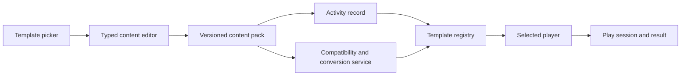

# Funwall: master product and implementation blueprint

Version: 1.0  
Research and planning date: 2026-07-14  
Status: build specification; no application code has been written  
Working product name: **Funwall**

## 1. What this document is for

This is the source-of-truth plan for building a private, Wordwall-like activity website around the six activity types that matter most:

1. Spin the wheel
2. Matching pairs
3. Gameshow quiz
4. Wordsearch
5. Image quiz
6. True or false

The finished product must let the owner create, save, find, edit, duplicate, play, and reuse activities. Images must be searchable inside the editor and insertable without leaving the application. The creation flow, visual rhythm, motion, and sound personality should feel very close to Wordwall while all code, branding, illustrations, icons, themes, and sound assets remain independently produced.

This plan deliberately excludes application code. It defines the product, architecture, contracts, sequencing, quality gates, and multi-agent workflow deeply enough that other agents can implement it without repeatedly asking product questions.

The companion work packets live in [`agent-work/`](agent-work/README.md). An implementation agent must read this file, [`agent-work/shared/CONTRACTS.md`](agent-work/shared/CONTRACTS.md), and its assigned `TASK.md` before changing application files.

## 2. Final-product contract

### 2.1 The product promise

The owner can go from an idea to a saved, classroom-ready activity in roughly one minute:

> Pick a template -> enter content -> add images in place -> save -> play.

The same activity remains available in **My Activities**, can be reopened and edited, and can be launched again without re-entering content.

### 2.2 Primary users

| User | Needs | Authentication |
|---|---|---|
| Owner/teacher | Create, edit, organize, configure, and launch activities | Required |
| Player/student | Open a shared activity, play, see a result | Not required for public play links |
| Future collaborator | Not part of version 1 | Out of scope |

This is a personal product, not a public creator marketplace. The data model may support multiple accounts safely, but the UI and roadmap should optimize for one owner and many anonymous players.

### 2.3 Launch scope

Launch is not complete until all of the following work end to end:

- Owner authentication and session persistence.
- A Wordwall-like template picker containing only the six requested templates.
- Template search and alphabetical/recommended sorting.
- Template-specific editors with inline image search, upload, removal, replacement, crop/fit selection, and editable alt text.
- Debounced draft autosave with explicit states: `Saving...`, `Saved`, and `Save failed`.
- A clear **Done** action that validates, saves, and opens the activity page.
- A **My Activities** dashboard with search, sort, folders, duplicate, rename, edit, play, share, and soft-delete/restore.
- Responsive play on desktop, tablet, phone, and classroom display.
- Fullscreen, sound on/off, restart, and exit controls.
- Wordwall-like themes, color hierarchy, interaction feedback, motion timing, and original sound-alike audio cues.
- Public, unguessable play URLs that do not expose owner controls.
- Local score/result summaries for every scored activity.
- Persistent results and a simple leaderboard for scored activities.
- Deterministic game seeds so a failed run can be reproduced in tests.
- Accessible keyboard and reduced-motion alternatives.
- Production deployment, backups, monitoring, and a tested rollback path.

### 2.4 Explicit non-goals for version 1

Agents must not silently add these to their scope:

- A public community library.
- Payments, plans, subscriptions, or artificial limits.
- AI activity generation.
- Printable worksheets or PDF generation.
- Live synchronous multiplayer rooms.
- School administration, classes, rosters, or LMS integration.
- Social profiles, comments, likes, or moderation.
- Native mobile applications.
- More activity types.
- Pixel-for-pixel copying of Wordwall logos, proprietary illustrations, theme art, or audio files.

These may become later projects, but none is allowed to delay the six-activity product.

## 3. Research findings that govern the build

### 3.1 Observed Wordwall workflow

Wordwall's current public materials and editor screenshots establish this flow:

1. The signed-in owner starts from **My Activities** and clicks **Create Activity**.
2. The template page presents a three-column card grid, template search, and recommended/alphabetical sorting.
3. A progress header reads **Pick a template > Enter content > Play**.
4. Selecting a template opens a content-first editor rather than a design canvas.
5. The activity title is first. Repeating content rows follow.
6. Each supported prompt or answer field exposes an image control; quiz-like templates allow two to six answers.
7. Pressing Enter or clicking **Add an item/question/pair** creates another row.
8. Rows can be reordered, duplicated, or removed.
9. The editor reports autosave status and has a prominent blue **Done** button.
10. The saved activity page places the playable stage on the left and **Switch template** choices on the right.
11. Visual style and gameplay options can be changed without rewriting content.
12. Scored activities end with result review and leaderboard entry. Spin the wheel is intentionally open-ended and has no leaderboard.

The defining product idea is not merely the set of games. It is the low-friction loop and the separation of reusable content from the player template.

### 3.2 Official template behavior captured for this plan

| Template | Editor content | Essential play behavior | Important options |
|---|---|---|---|
| Spin the wheel | Optional instruction plus a list of text/image/audio items | Spin by button or gesture; slow to a random segment; zoom to the result; spin again, resume, or eliminate the chosen item | Timer, spin power, shuffle item order |
| Matching pairs | Identical pairs or related/different pairs; either side can be text or image | Reveal two hidden tiles; matched tiles remain revealed or disappear; mismatches flip back; finish on all matches | Timer, numbered backs, eliminate matched tiles, auto-proceed, mixed/separated layout |
| Gameshow quiz | Question plus 2-6 answers; question and answers can use images; one correct answer for v1 | Timed multiple-choice rounds, lives, lifelines, bonus rounds, dramatic result screen | Per-question timer, lives, bonus frequency, 50:50, x2 score, extra time, reveal/cheat, shuffling, review answers |
| Wordsearch | Words alone or target word plus a text/image clue | Generate a letter grid; select a hidden word; mark found words and clues; review misses at end | Timer, lives, tap-first/tap-any/drag behavior, visible word list, diagonal, reverse, letter case, review answers |
| Image quiz | Prompt, required reveal image, 2-6 answers, one correct answer; answer images optional | Reveal the main image tile by tile; buzzer pauses reveal; player answers; speed affects points | Reveal duration, points, lives, question shuffle, auto-proceed, together/separate answer layout, review answers |
| True or false | A list of statements, each explicitly marked true or false; optional image/audio | Statement cards move through the stage; player selects True or False before expiry; repeat if configured | Timer, speed, lives, repeat-until-time, review answers |

### 3.3 Visual observations

The user's reference screenshots and the current public activity page were measured rather than guessed.

| Token | Reference value | Intended use |
|---|---:|---|
| Page canvas | `#E7F3F9` current; `#E7F6FF` in supplied reference | App/player background |
| Template icon panel | `#CFEEFF` / `#E7F6FF` | Left panel of template cards |
| Hairline border | `#BECCD1` / `#C2CFD3` | Template cards, inputs, panels |
| Primary blue | `#0DA9FF`, with lighter `#35B7FF` | Main buttons, active template, focus accents |
| Link blue measured on current site | `#1C94D6` | Links and restrained actions |
| Coral accent | `#FF4B63` | Incorrect state, playful accent, select icon details |
| Muted text | `#828282` | Secondary descriptions and metadata |
| Ink | `#111111` | Titles and primary text |
| Body font observed | Open Sans with language fallbacks | Forms, descriptions, controls |
| Heading font observed | Reddit Sans with language fallbacks | Page and section titles |

Use these as parity targets, not as permission to copy branded artwork. The interface should feel airy, bright, flat, and teacher-friendly: pale-blue canvas, crisp white panels, thin blue-gray borders, modest radii, large touch targets, friendly rounded icons, and almost no heavy shadow.

### 3.4 Sound observations and clean-room rule

Wordwall's interaction identity depends on frequent, short audio feedback: wheel ticks, card turns, success chimes, error cues, countdown urgency, bonus reveals, result fanfares, and crowd/game-show energy.

No Wordwall audio file may be downloaded, copied, traced, or redistributed. The audio workstream must create original cues with similar **function, duration, energy, and envelope**, while changing melodic intervals, timbre, layering, and recordings enough to be independently authored.

### 3.5 Existing repository audit

Repository status was checked on 2026-07-14. Stars and activity dates are a snapshot and will drift.

| Repository | What it contains | Reuse decision |
|---|---|---|
| [yasin-umam/wordwall-clone](https://github.com/yasin-umam/wordwall-clone) | Recent TypeScript/Vite/Supabase clone with auth, dashboard, universal editor, template switching, themes, leaderboard, and six games. Its central content/template separation is the right architectural idea. The public deployment reaches a login screen. | **Reference only.** No license is declared, so code and assets must not be copied. It also lacks several required templates. |
| [goksoysofia/wordwall](https://github.com/goksoysofia/wordwall) | Next.js/Supabase product with saved activities, image search through Pexels, Web Audio sounds, themes, wheel, memory, true/false, and word search among many activity types. | **Reference only.** No license is declared and the linked deployment currently returns `DEPLOYMENT_NOT_FOUND`. Useful for identifying risks and seams, not for copying. |
| [davidsumut/wordwall-clone](https://github.com/davidsumut/wordwall-clone) | Repository description claims a native PHP/MySQL clone, but the repository is empty. | Ignore. |
| [min0k/wordwall](https://github.com/min0k/wordwall) | Small 2022 MERN learning project centered on a simple word wall, not a Wordwall activity platform. | Ignore for architecture. |
| [H5P Memory Game](https://github.com/h5p/h5p-memory-game), [H5P True/False](https://github.com/h5p/h5p-true-false), [H5P MultiChoice](https://github.com/h5p/h5p-multi-choice) | Mature interactive-content implementations. Their `library.json` files declare MIT licensing. | Good behavioral, accessibility, and edge-case references. Do not adopt the full H5P runtime for this focused product. Reuse code only if attribution/license obligations are explicitly recorded. |
| [CrazyTim/spin-wheel](https://github.com/CrazyTim/spin-wheel) | MIT-licensed, themeable web spinning-wheel component; 347 stars in the snapshot. | Candidate for the low-level wheel renderer/physics after an isolated prototype. Wrap it behind Funwall's adapter; do not let its API leak into the domain model. |
| [joshbduncan/word-search-generator](https://github.com/joshbduncan/word-search-generator) | MIT-licensed TypeScript word-search generator; 108 stars in the snapshot. | Candidate algorithm/reference. Audit Unicode behavior, deterministic seeding, reverse/diagonal support, and bundle suitability before adoption. |
| [Lumi H5P Node.js library](https://github.com/Lumieducation/H5P-Nodejs-library) | Full H5P server/client integration under GPL-3.0. | Too large and license-coupled for the preferred clean-room build. Use only if the project deliberately accepts GPL for the whole combined work. |

**Conclusion:** build Funwall greenfield. Borrow product lessons and use narrowly scoped MIT components only after a license file, version, attribution, and replacement plan have been recorded in `THIRD_PARTY_NOTICES.md`.

## 4. Product information architecture

### 4.1 Owner routes

| Route | Purpose |
|---|---|
| `/login` | Owner sign-in and password reset |
| `/activities` | My Activities dashboard |
| `/activities/new` | Template selection |
| `/activities/new/[template]` | New-activity editor |
| `/activities/[id]` | Owner activity page: stage, switch template, style, options, share, results |
| `/activities/[id]/edit` | Edit content |
| `/activities/[id]/results` | Attempts and leaderboard |
| `/trash` | Soft-deleted activities and restore |
| `/settings` | Account, defaults, sound, and reduced-motion preferences |

### 4.2 Player routes

| Route | Purpose |
|---|---|
| `/play/[publicSlug]` | No-login player start page |
| `/play/[publicSlug]/run/[sessionId]` | Active/recoverable attempt; may remain one client route internally |
| `/play/[publicSlug]/result/[sessionId]` | Result review and optional name submission |

Public routes must never render owner edit controls or expose database identifiers that enable enumeration.

### 4.3 Dashboard behavior

The dashboard is part of the core loop, not a later admin screen.

- Default view: cards ordered by most recently updated.
- Card contents: thumbnail derived from template, title, template label, updated date, folder, play count.
- Primary card click: open owner activity page.
- Overflow menu: Play, Edit content, Duplicate, Rename, Move to folder, Share, Delete.
- Search: title and normalized activity content.
- Filters: template and folder.
- Sort: updated, created, title, most played.
- Empty state: six compact template cards and a **Create your first activity** action.
- Soft delete: move to Trash; deletion does not immediately remove media or results.
- Duplicate: clone content/settings/theme, assign a new ID/slug, suffix title with `copy`, and keep the source unchanged.

## 5. The creation workflow in exact detail

### 5.1 Step 1: Pick a template

Replicate the supplied reference's structure:

- White content area on the pale-blue app canvas.
- Top progress strip: **Pick a template > Enter content > Play**.
- Search field at top right with placeholder `Search templates`.
- Sort controls: **Recommended** and **Alphabetical**.
- Three-column desktop grid, two columns on tablet, one on phone.
- Each card has a pale-blue illustration pane, template title, and one-sentence behavior description.
- Only the six requested templates appear. Do not show locked or fake templates.
- Recommended order:
  1. Spin the wheel
  2. Matching pairs
  3. Gameshow quiz
  4. Wordsearch
  5. Image quiz
  6. True or false
- Clicking anywhere on a card selects it and immediately opens the editor.
- Keyboard: cards are focusable; Enter/Space selects; focus ring is clearly visible.

### 5.2 Step 2: Enter content

Common editor frame:

- Same progress strip, with **Enter content** visually active.
- Selected template icon and name at top right.
- Autosave status immediately left of the selected template.
- `Activity title` field first; default title is blank with an instructive placeholder, not `Untitled284`.
- Optional `+ Instruction` control below the title.
- Template-specific repeating rows inside a centered white editor panel.
- Row-level controls aligned right: drag/reorder, duplicate, delete.
- Image and audio affordances live beside the exact field they enrich.
- **Add item/question/pair/word** action below the last row.
- Minimum and maximum limits shown as quiet helper text.
- Sticky or reliably visible blue **Done** button.
- Validation appears next to the invalid row and in a summary near Done.
- Autosave stores incomplete drafts, but Done only succeeds when play requirements are satisfied.

Autosave state machine:

1. `clean`: no unsaved changes.
2. `dirty`: local content differs from the server.
3. `saving`: request in flight.
4. `saved`: server version acknowledged; show the time only if useful.
5. `error`: retain local edits, show retry, never discard silently.
6. `conflict`: another version is newer; preserve both and ask the owner to choose, even if this is rare in a single-owner product.

Implementation requirements:

- Debounce normal typing by 700-1000 ms.
- Flush on route change, tab hidden, and Done.
- Use monotonically increasing content revisions or optimistic version columns.
- Maintain a local recovery draft keyed by activity ID until the server acknowledges the latest revision.
- Do not create a new database row for every keystroke.

### 5.3 Inline image workflow

Clicking an image button opens one consistent modal:

1. Tabs: **Search**, **Upload**, **My images**.
2. Search is active by default; the nearest field text becomes a suggested query but search does not start until the user confirms or types.
3. Results appear in a dense, responsive thumbnail grid with source/creator attribution available.
4. Selecting a result opens a confirmation/crop stage.
5. The owner chooses `Contain`, `Cover`, or a crop; focal point is stored.
6. Alt text is prefilled from source metadata or query and remains editable.
7. **Use image** inserts it into the exact field that opened the modal.
8. The editor shows replace and remove actions on hover/focus.

Provider strategy:

- **Primary:** [Openverse](https://api.openverse.org/) for openly licensed/public-domain media and rich license metadata.
- **Optional fallback:** [Pexels](https://www.pexels.com/api/documentation/) for broader stock photography, with visible attribution and provider terms honored.
- Do not scrape Google Images, Bing Images, Pinterest, or Wordwall.
- Search providers are called only from the server; API keys never reach the browser.
- Search requests are debounced, cached, paginated, and rate-limited per owner.
- Store provider, source URL, creator, creator URL, license, license URL, attribution text, original dimensions, and the exact selected derivative.
- For sources that require hotlinking or selection/download callbacks, preserve that workflow. Provider terms outrank convenience.
- Prefer proxying/copying only when the provider license and API terms permit it. Otherwise store and render the required remote derivative.

Uploads:

- Accept JPEG, PNG, WebP, and non-script SVG only if sanitized; simplest v1 choice is to reject SVG uploads.
- Maximum input size: 10 MB.
- Strip metadata, auto-orient, generate safe WebP/AVIF derivatives, and retain a bounded original only if needed for recropping.
- Reject decompression bombs and mismatched MIME signatures.
- Images belong to the owner and can be reused from **My images**.

### 5.4 Step 3: Play and configure

Done opens the owner activity page:

- Large 16:9 stage on the left.
- Compact **Switch template** panel on the right on wide screens; drawer on narrow screens.
- Start overlay with template name, title, one-line instruction, and a large blue play button.
- Stage controls: sound, fullscreen, restart, and exit.
- Below the stage: title, share, edit content, duplicate, and results actions.
- Below or beside those: **Visual style** and **Options**.
- A setting change previews immediately but persists only after **Apply to this activity**.
- Template defaults live in owner settings and can be reset.

## 6. Content architecture and template switching

### 6.1 Core rule

Do not couple saved educational content to React components or a game renderer. A saved activity contains a versioned content pack, a selected template, a theme, and template settings. A template registry declares what content it accepts and how it validates, edits, previews, plays, scores, and converts.



### 6.2 Content pack families

Use discriminated, versioned families rather than one unbounded object full of optional fields.

| Family | Required shape | Native templates |
|---|---|---|
| `list.v1` | Optional instruction; ordered items with rich content | Spin the wheel |
| `pairs.v1` | Pair mode; ordered pairs with left and right rich content | Matching pairs |
| `quiz.v1` | Ordered questions; prompt rich content; 2-6 answers; correct answer ID | Gameshow quiz |
| `imageQuiz.v1` | Quiz fields plus required reveal image and reveal metadata | Image quiz |
| `wordsearch.v1` | Ordered display words; normalized grid value; optional rich clue | Wordsearch |
| `statements.v1` | Ordered rich statements with explicit boolean truth value | True or false |

`Rich content` in this plan means a bounded structure that can contain text, one image reference, one audio reference, and alt/transcript metadata. It is not arbitrary HTML.

Every item, answer, pair side, and statement has a stable UUID. Reordering must not replace IDs.

### 6.3 Template registry contract

Each template registration owns:

- Stable template key and human-readable metadata.
- Supported content-family versions.
- Minimum/maximum content rules.
- Default theme and settings.
- Editor adapter.
- Preview adapter.
- Player adapter.
- Settings schema and migration function.
- Compatibility detector.
- Explicit converters from other content families.
- Score policy and leaderboard policy.
- Result-review adapter.
- Thumbnail/illustration reference.

Only the integration lead may merge changes to the central registry. Activity agents export their registrations from their own folders.

### 6.4 Compatibility matrix

Switching must never silently destroy content. The UI shows only safe or explicitly reviewable conversions.

| From / To | Wheel | Pairs | Gameshow | Wordsearch | Image quiz | True/False |
|---|---|---|---|---|---|---|
| Wheel list | Native | Blocked: missing pair side | Blocked: missing answers | Reviewable if every item is usable as a word | Blocked | Blocked |
| Pairs | Reviewable: choose left, right, or both | Native | Reviewable: left becomes prompt, right becomes correct answer, distractors required | Reviewable: choose word side and clue side | Blocked until reveal image/answers supplied | Blocked |
| Gameshow quiz | Reviewable: use question prompts or correct answers | Reviewable: question to correct answer | Native | Reviewable: use correct answers as words and prompts as clues | Reviewable only after every question receives a reveal image | Only safe for questions whose choices are exactly True/False |
| Wordsearch | Reviewable: words or clues as items | Reviewable when clues exist | Reviewable but distractors must be authored | Native | Blocked | Blocked |
| Image quiz | Reviewable: prompts or correct answers | Reviewable: reveal image to correct answer | Safe: discard reveal behavior only after confirmation; retain images in source history | Reviewable: correct answer as word, prompt as clue | Native | Blocked |
| True/False | Reviewable: statement list | Blocked | Safe conversion to binary quiz | Blocked | Blocked | Native |

For every reviewable conversion:

1. Show a preview of transformed content.
2. List missing data and information that would not be used.
3. Never mutate the source activity in place.
4. Default action creates a new activity named `<original> - <template>`.
5. Offer `Replace current template` only when conversion is lossless.
6. Record conversion provenance so the original can be recovered.

### 6.5 Activity and result records

Recommended logical tables:

| Table | Essential fields |
|---|---|
| `activities` | ID, owner ID, folder ID, title, instruction, selected template, content family/version, content JSON, settings JSON, theme key, draft/published state, public slug hash, revision, created/updated/deleted timestamps |
| `activity_versions` | Activity ID, revision, content/settings/theme snapshot, author, created time, reason (`autosave`, `done`, `conversion`, `restore`) |
| `folders` | ID, owner ID, name, sort order, timestamps |
| `media_assets` | ID, owner ID, storage/remote locator, provider metadata, license/attribution, dimensions, MIME, hash, crop/focal metadata, timestamps, soft-delete state |
| `play_sessions` | ID, activity ID, public slug reference, template key/version, seed, anonymous player token/name, start/end, status, score, duration, accuracy, settings snapshot |
| `play_events` | Session ID, monotonically increasing sequence, event type, item ID, correctness, points delta, elapsed time, bounded metadata |
| `leaderboard_entries` | Session ID, activity ID, display name, score, duration, submitted time, moderation state |
| `owner_preferences` | Owner ID, sound/reduced-motion preferences, per-template default settings |

The database stores validated domain data, never serialized component state.

## 7. Player-shell contract

Every game plugs into a shared player shell so six agents do not build six incompatible products.

### 7.1 Shared player lifecycle

`loading -> ready -> playing -> paused -> feedback -> completed | gameOver -> review`

The shell owns:

- Asset preloading and a recoverable loading state.
- Autoplay-safe audio initialization after the player's first gesture.
- Timer lifecycle and visibility behavior.
- Fullscreen, mute, restart, and exit.
- Seed creation and persistence.
- Session creation and completion.
- Result persistence with offline retry.
- Common HUD: progress, score, lives, timer.
- Error boundary with restart and report options.
- Reduced-motion mode.
- Public/owner chrome differences.

The game owns:

- Content-specific board/stage.
- Valid actions and state transitions.
- Correctness and template-specific scoring inputs.
- Template-specific feedback and result detail.

### 7.2 Determinism

At player start, generate and persist one seed. All shuffle order, bonus selection, tile reveal order, grid layout, and randomized animations that affect gameplay derive from a seeded pseudo-random source. Decorative particles may remain non-deterministic if they never affect the result.

Tests must be able to replay a session from activity revision + settings snapshot + seed + ordered player actions.

### 7.3 Scoring principles

- Scores are integers and never negative.
- Correctness is the primary component.
- Time bonus is bounded so fast random guessing cannot dominate understanding.
- Lifelines that reveal information reduce the maximum points for that question.
- A restart creates a new attempt.
- The server treats client-calculated scores as untrusted. For personal v1, it may validate from submitted event logs rather than run every game server-side.
- Wheel has no score or leaderboard.

## 8. Detailed activity specifications

### 8.1 Spin the wheel

#### Editor

- Optional question/instruction.
- 2-100 items; warn above 30 because labels become hard to read.
- Each item supports text, image, or both; audio is optional enhancement.
- Bulk-paste mode: one item per line.
- Reorder, duplicate, remove.

#### Player state

`intro -> idle -> dragging/spinning -> decelerating -> selected -> idle | complete`

#### Behavior

- Render with SVG or an isolated audited wheel library, not an inaccessible bitmap-only canvas.
- Predetermine the winner with seeded randomness before animation begins.
- Animate 4-7 seconds depending on `spin power`.
- Pointer tick fires as segment boundaries cross; rate follows actual angular velocity.
- Input is locked during deceleration.
- After landing, zoom/emphasize the winning segment and show the full item.
- Actions: **Resume**, **Spin again**, **Eliminate**.
- Eliminate changes only the current session. It does not delete saved content.
- When one item remains, show completion and a reset option.
- Support button spin first. Gesture/fling spin is progressive enhancement.

#### Settings

- Timer: none, count up, count down.
- Spin power: low/high.
- Shuffle item order at session start.
- Allow eliminate.
- Show images on segments when legible; otherwise show them in the result panel.

#### Acceptance highlights

- The selected item always equals the pointer segment after animation.
- Rapid repeated clicks cannot start overlapping spins.
- Muting removes ticks immediately without affecting animation.
- Labels remain readable or intentionally abbreviated from 2 through 100 items.

### 8.2 Matching pairs

#### Editor

- Mode: identical pairs or related/different pairs.
- 2-30 pairs; default guidance is 6-12.
- Each side supports text/image/audio.
- Identical mode edits one side and mirrors it at play time; do not duplicate stored media unnecessarily.
- Bulk import supports tab-separated left/right values.

#### Player state

`intro -> ready -> oneSelected -> checking -> matched | mismatch -> ready -> completed/gameOver`

#### Behavior

- Build the deck from stable pair IDs and side IDs, then seeded-shuffle it.
- First tile reveals immediately.
- Second tile reveals, then input locks during evaluation.
- Match feedback is immediate; matched tiles remain face-up or are removed based on settings.
- Mismatch stays visible 650-900 ms in normal motion mode, then flips back.
- Count attempts as two-tile checks, not individual taps.
- Use a responsive grid that avoids tiny cards; paginate or scale the stage for very large decks.
- Keyboard focus order follows visible grid order and remains stable while cards are face-down.

#### Settings

- Timer: none, count up, count down.
- Show numbers on tile backs.
- Remove matched tiles.
- Automatically proceed after marking.
- Layout: mixed or separated.
- Lives or unlimited mistakes; default unlimited.

#### Acceptance highlights

- A tile cannot match itself.
- Third-tile input is ignored while two tiles are resolving.
- Image decoding failure shows a usable fallback and alt text.
- Completion result reports pairs, attempts, accuracy, and time.

### 8.3 Gameshow quiz

#### Editor

- 1-100 questions; recommend at least 5.
- Prompt text with optional image/audio.
- 2-6 answers; exactly one correct answer in v1.
- Answer text, image, or both.
- Reorder/duplicate/delete questions.
- Shuffle preview without mutating saved order.

#### Player state

`intro -> questionEnter -> answering -> locked/feedback -> bonusMaybe -> next -> completed/gameOver -> review`

#### Behavior

- One question per screen inside a TV-game-show stage.
- Per-question countdown is visually prominent.
- Answer selection locks immediately and reveals correct/incorrect styling.
- Base points + bounded remaining-time bonus + active x2 modifier.
- Wrong answer decrements a life when lives are finite.
- Bonus round occurs after configured question count, never after the final question.
- Bonus rewards come from a deterministic deck: flat points, multiplier, extra life, or lifeline refill.
- Lifelines:
  - **50:50:** remove two seeded incorrect choices; disabled when fewer than two can be removed.
  - **x2 Score:** arm before answering; consumed on that question.
  - **Extra Time:** add a fixed bounded interval once.
  - **Reveal:** highlight the correct answer but cap that question's score sharply.
- Review shows prompt, chosen answer, correct answer, points, and lifelines used.

#### Default settings

- 30 seconds per question.
- Unlimited lives for low-stress default; owner may select 1-5.
- Bonus every 3 questions.
- 50:50, x2, and extra time enabled; Reveal disabled.
- Shuffle questions and answers off by default.
- Show answers at end on.

#### Acceptance highlights

- Timeout is recorded exactly once as incorrect/unanswered.
- Lifeline use is idempotent under double clicks.
- No bonus appears after completion or game over.
- Score recalculates identically from the stored event log.

### 8.4 Wordsearch

#### Editor

- Mode: words only or words with clues.
- 2-40 entries; recommend 6-16.
- Store the user's display word separately from its normalized grid representation.
- Clue supports text/image/audio.
- Inline validation explains unsupported characters, duplicate normalized values, and impossible word length.

#### Generator

- Seeded and deterministic.
- Normalize using Unicode-aware rules selected per activity language.
- Preserve accents in the displayed word. The owner chooses whether the grid retains or folds diacritics; default retain when the alphabet supports it.
- Remove spaces/hyphens only for placement while preserving them in display/review.
- Directions derive from settings: horizontal/vertical, optional diagonal, optional reverse.
- Prefer intersections but do not make them mandatory.
- Use bounded backtracking. Begin with a calculated grid size, retry with alternate order, then grow up to a documented maximum.
- If placement still fails, return a clear editor error listing problematic words; never hang.
- Fill unused cells from a language-appropriate alphabet distribution when available, otherwise uniform allowed letters.

#### Player behavior

- Grid cells are semantic buttons/elements, not a single opaque canvas.
- Pointer drag selects a straight line; keyboard selection supports start cell + direction + length.
- Also support Wordwall-like `tap any letter` or `tap first letter` assistance modes.
- Correct selection highlights the path and marks the word/clue found.
- Incorrect selection may cost a life when configured.
- With clues, selecting/finding a word binds it to the matching clue and then advances the clue state.

#### Settings

- Timer, lives.
- Selection mode: drag full word, tap first letter, tap any letter.
- Display target word list.
- Allow diagonal.
- Allow reverse.
- Lowercase/uppercase.
- Show answers at end.

#### Acceptance highlights

- Golden tests cover 100+ seeds and prove every target occurs at the recorded path.
- Duplicate normalized words are rejected.
- Very long or non-Latin words fail gracefully or use an explicitly selected alphabet policy.
- Selection works with mouse, touch, and keyboard.

### 8.5 Image quiz

#### Editor

- 1-100 questions.
- Prompt text optional but recommended.
- One required reveal image per question.
- 2-6 answers, exactly one correct.
- Answer images optional.
- Image crop and focal point are visible in editor preview.

#### Player state

`intro -> revealing -> buzzed -> answering -> feedback -> next -> completed/gameOver -> review`

#### Reveal system

- Divide the image into a responsive logical grid, default 12 x 8 in landscape.
- Use a seeded shuffled tile order that avoids revealing only one corner for too long.
- Reveal tiles on a schedule derived from total reveal duration.
- The Buzzer is a large primary control and keyboard Space target.
- Buzzer pauses reveal immediately and moves to answering.
- If no buzz occurs, all tiles reveal and answer choices appear automatically.
- Two layouts: image then answers, or image and answers together.

#### Scoring

- Base correctness points.
- Reveal bonus based on fraction of still-hidden tiles at buzz time.
- Small bounded answer-time bonus.
- Wrong answer receives zero for the question and may cost a life.
- Do not award points merely for buzzing early.

#### Settings

- Reveal duration, default 30 seconds.
- Base points per question.
- Lives.
- Shuffle question order.
- Auto-proceed after feedback.
- Show answers at end.
- Separate/together layout.

#### Acceptance highlights

- Reveal pauses within one animation frame of a valid buzz.
- Responsive resizing does not change logical reveal progress.
- Broken images block play with a recoverable owner-facing error.
- Score is reproducible from seed, timestamps, and actions.

### 8.6 True or false

#### Editor

- 2-200 statements.
- Each statement has text/image/audio and one explicit truth value.
- Default editor view can group True and False items visually, but storage remains one ordered list.
- Warn when the set is extremely imbalanced, but do not block.

#### Player state

`intro -> itemEntering -> answerWindow -> answered/expired -> feedback -> itemLeaving -> next/repeat -> completed/gameOver -> review`

#### Behavior

- Present one highly readable moving statement card at a time.
- Large True and False targets remain fixed, not moving.
- At normal speed, a player has enough time to read an average sentence.
- Correct/incorrect stamp and sound appear immediately.
- Expired items count as unanswered and may cost a life.
- If repeat-until-time is on, reshuffle only after all items have appeared once.
- Track accuracy separately from speed score.

#### Settings

- Timer: none, count up, count down.
- Speed: 1-10; default 5.
- Lives or unlimited.
- Repeat questions until time runs out.
- Show answers at end.

#### Acceptance highlights

- A single statement cannot accept both buttons.
- Answer at the expiry boundary resolves once according to a documented timestamp rule.
- Reduced-motion mode replaces flight with a stationary timed card and progress bar.
- Review preserves the original order and truth value.

## 9. Visual-system specification

### 9.1 Clean-room design principle

Match the recognizable **experience class**—light blue classroom canvas, white content cards, vivid sky-blue controls, coral contrast, friendly typography, flat icons, playful game stages—without using Wordwall's name, logo, illustrations, theme images, or proprietary screen artwork.

### 9.2 Core tokens

| Category | Token | Value/behavior |
|---|---|---|
| Color | canvas | `#E7F3F9` |
| Color | surface | `#FFFFFF` |
| Color | tile pale | `#CFEEFF` |
| Color | border | `#BECCD1` |
| Color | primary | `#0DA9FF` |
| Color | primary hover | darken by about 8%; verify contrast |
| Color | primary light | `#35B7FF` |
| Color | coral | `#FF4B63` |
| Color | ink | `#111111` |
| Color | muted | `#828282` |
| Color | success | independent teal/green token meeting AA; do not rely on color alone |
| Typography | heading | Reddit Sans, 700 |
| Typography | body | Open Sans, 400/600/700 |
| Radius | controls/cards | 5-8 px; avoid pill-everything styling |
| Border | panels | 1 px solid border token |
| Shadow | cards | none or very soft 0 1 px 2 px; no floating-dashboard aesthetic |
| Spacing | base | 4 px; common increments 8, 12, 16, 24, 32 |
| Touch | target | minimum 44 x 44 px |

### 9.3 Component character

- Buttons are rectangular with modest radius and strong text, not glossy.
- Template cards split illustration and copy areas exactly enough to echo the supplied references.
- Inputs are white, one-pixel bordered, and dense enough for fast authoring.
- Icons use consistent rounded geometry and a limited blue/coral palette.
- Game canvases can be dramatic and themed; the surrounding owner UI stays restrained.
- Avoid gradients in the editor shell. Gradients are allowed inside game themes when purposeful.
- Avoid generic glassmorphism, giant hero text, excessive rounded cards, and decorative marketing sections.

### 9.4 Themes at launch

Ship four complete, original themes rather than many incomplete ones:

1. **Classic** — closest to the clean blue/coral reference.
2. **TV game show** — deep navy stage, marquee bulbs, gold accents.
3. **Classroom** — warm paper, chalk/marker details, restrained school icons.
4. **High readability** — minimal decoration, maximum contrast, dyslexia-friendly font option.

Every theme defines background, stage frame, surface, primary/secondary/accent colors, correct/incorrect presentation, tile backs, wheel palette, typography, decorative intensity, and sound-pack key.

## 10. Audio and motion system

### 10.1 Audio event vocabulary

| Event | Target character | Target duration |
|---|---|---:|
| UI press | Soft plastic/wood click | 40-80 ms |
| Wheel boundary | Dry high tick; rate follows wheel speed | 20-40 ms |
| Wheel selected | Short original fanfare + impact | 400-700 ms |
| Card flip | Light paper/plastic turn | 90-160 ms |
| Pair match | Bright two/three-note sparkle | 250-450 ms |
| Pair miss | Soft low thunk, non-punitive | 180-320 ms |
| Correct | Fast rising interval | 220-400 ms |
| Incorrect | Short filtered buzz/downward interval | 250-450 ms |
| Countdown | Neutral tick; more urgent in final five seconds | 40-100 ms each |
| Lifeline | Distinct activation sweep | 250-500 ms |
| Bonus reveal | Suspense roll + reward sting | 700-1500 ms |
| Image tile reveal | Very quiet soft plink; rate-limited | 20-60 ms |
| Buzzer | Tactile game-show button hit | 120-250 ms |
| Word found | Trace whoosh + bright resolve | 250-500 ms |
| True/False card | Airy pass/slide | 120-300 ms |
| Game complete | Original celebratory sting | 900-1800 ms |
| Game over | Gentle descending resolve | 500-900 ms |

### 10.2 Audio implementation rules

- Central audio service; games emit semantic events rather than importing files directly.
- Two implementation paths are allowed: original Web Audio synthesis or original/licensed sample assets through Howler.
- Master, music/ambience, effects, and voice buses.
- Default volume must be classroom-safe and avoid startling peaks.
- Limit repeated ticks/plinks to prevent clipping and fatigue.
- First user gesture unlocks audio; no autoplay error is shown as a product failure.
- Mute state persists locally for players and in the owner profile for the owner.
- Audio never carries information that is unavailable visually.
- Automated tests verify event emission and mute behavior; human QA verifies feel on laptop speakers and classroom display.

### 10.3 Motion timing

- UI press feedback: 80-120 ms.
- Panel/row transitions: 160-220 ms.
- Correct feedback: 250-450 ms.
- Incorrect feedback: 300-550 ms without aggressive shake.
- Card flip: 350-500 ms total.
- Page transitions: under 300 ms.
- Wheel is the intentional exception at 4-7 seconds.
- Reduced-motion replaces spatial flight, zoom, flip, and particle effects with fades/state changes under 150 ms.

## 11. Recommended technical architecture

### 11.1 Stack

| Layer | Recommendation | Reason |
|---|---|---|
| Web app | Next.js App Router + React + strict TypeScript | One deployable full-stack project, strong route/server support, easy public/owner split |
| Styling | Tailwind CSS for tokens/layout plus colocated CSS for complex game stages | Fast shared system without forcing game animation into unreadable utility strings |
| Validation | Zod schemas shared at server boundaries | Versioned, explicit content and settings validation |
| Database/auth/storage | Supabase Postgres, Auth, Storage, row-level security | Fast personal deployment with real relational safety and media storage |
| Hosting | Vercel for web; Supabase managed project | Simple previews, production deploy, and rollback |
| Unit/component tests | Vitest + Testing Library | Fast domain and UI feedback |
| End-to-end | Playwright | Creation/play flows and visual regression |
| Motion | CSS/Web Animations first; Framer Motion for coordinated UI transitions | Keeps bundle and semantics controlled |
| Audio | Web Audio API and/or Howler behind one semantic service | Original sound design with reliable playback |
| Image processing | Sharp on trusted server runtime | Orientation, resize, metadata removal, WebP/AVIF derivatives |

Current package versions observed from npm on the planning date were Next 16.2.10, React 19.2.7, TypeScript 7.0.2, Tailwind 4.3.2, Supabase JS 2.110.3, Zod 4.4.3, Vitest 4.1.10, Playwright 1.61.1, Framer Motion 12.42.2, Howler 2.2.4, and Sharp 0.35.3. Do not paste this list into a package manifest blindly. The foundation agent must choose a compatible set, pin it in the lockfile, and record any deliberate downgrade.

### 11.2 Proposed source boundaries

```text
src/
  app/                         route composition only
  features/
    activities/                dashboard, persistence, versions
    editor/                    shared editor frame and rich fields
    media/                     search, upload, crop, attribution
    player/                    shared lifecycle, HUD, sessions
    templates/
      wheel/
      matching-pairs/
      gameshow-quiz/
      wordsearch/
      image-quiz/
      true-false/
    results/                   review and leaderboard
  domain/                      schemas, conversions, scoring contracts
  design-system/               tokens and shared UI primitives
  services/                    Supabase, audio, seeded RNG, telemetry
  test/                        fixtures, builders, replay helpers
supabase/
  migrations/
  seed.sql
public/
  original theme art, icons, and licensed audio only
```

Feature folders may depend on `domain`, `design-system`, and public service interfaces. They may not import another template's internal components.

### 11.3 API boundaries

Minimum server endpoints/actions:

- Activities: list, create draft, get, autosave revision, finalize, duplicate, move, soft-delete, restore.
- Template conversion: preview conversion, confirm conversion.
- Media: search, upload, finalize crop metadata, list owner library, soft-delete.
- Public play: resolve slug to sanitized activity snapshot.
- Sessions: start, append bounded event batch, complete, submit leaderboard name.
- Results: owner list/detail/export later.

Every input is validated server-side. Never trust template keys, media URLs, scores, owner IDs, or public slugs from the browser.

## 12. Security, privacy, and reliability

### 12.1 Database access

- Row-level security on every owner table.
- Owner can read/write only owned activities, folders, assets, defaults, and results.
- Anonymous player can read only a published sanitized snapshot resolved from a valid public slug.
- Anonymous player can create/update only its own active session through controlled server code.
- Service-role keys never reach the browser.

### 12.2 Public links

- Use at least 128 bits of randomness, URL-safe encoded.
- Store a hash if practical so leaked database reads do not reveal active links.
- Owner can regenerate or disable a link.
- Public response excludes owner ID, internal notes, provider secrets, deleted media, draft versions, and settings not used by the player.

### 12.3 Media security

- Server fetches remote metadata with strict allowlists for configured providers.
- Never accept an arbitrary URL for server-side fetching without SSRF protection.
- Validate final resolved host/IP, redirect count, content length, MIME signature, dimensions, and timeout.
- Rate-limit search and upload.
- Strip EXIF/GPS.
- Sanitize filenames and never execute uploaded content.
- Keep attribution and license metadata attached to each asset.

### 12.4 Recovery

- Daily database backup or Supabase point-in-time recovery appropriate to budget.
- Storage lifecycle documented and tested.
- Activity revisions retained for at least 30 days.
- Soft delete retained for 30 days before permanent cleanup.
- Autosave local recovery survives refresh and transient network failure.
- Production release includes a migration rollback/forward-fix note.

## 13. Accessibility and international behavior

- Target WCAG 2.2 AA for owner and player flows.
- All creation controls use real labels, errors, and descriptions.
- Never use color alone for correct/incorrect.
- Full keyboard support for template selection, editing, game actions, results, and dialogs.
- Focus is trapped/restored correctly in media modal and game overlays.
- Screen-reader live regions announce timer thresholds, correctness, match state, found word, and completion without excessive chatter.
- Wheel exposes the selected item as text; spinning motion is optional.
- Wordsearch provides a keyboard and list-based interaction path.
- True/false reduced-motion mode is stationary.
- Images require alt text; audio requires transcript/label.
- Touch targets are at least 44 x 44 px.
- Test 200% zoom and narrow view without content loss.
- Treat content as Unicode. Do not assume ASCII or English word boundaries.
- Interface localization is not required at launch, but strings must not be hard-coded inside game logic.

## 14. Testing strategy and non-negotiable test journeys

### 14.1 Test pyramid

1. **Domain unit tests:** schemas, migrations, conversion, seeded RNG, scoring, grid generation, replay.
2. **Component tests:** editor rows, validation, media modal, HUD, settings, result review.
3. **Integration tests:** persistence, RLS, public snapshots, media provider adapters, result validation.
4. **End-to-end tests:** owner creation through anonymous player completion.
5. **Visual regression:** template picker, every editor, every start/play/feedback/result screen.
6. **Human sensory QA:** animation feel, audio mix, classroom readability, touch devices.

### 14.2 Required end-to-end journeys

For each of the six templates:

1. Sign in as owner.
2. Create from template picker.
3. Enter the smallest valid content.
4. Add at least one searched or uploaded image where supported.
5. Observe autosave.
6. Click Done.
7. Reload and confirm persistence.
8. Edit one item, reorder, duplicate, and delete another.
9. Change theme and one gameplay setting.
10. Open public link in a clean browser context.
11. Complete or intentionally fail the game.
12. Submit a leaderboard name if scored.
13. Return as owner and see the result.
14. Duplicate the activity and prove the original is unchanged.
15. Soft-delete and restore it.

Additional journeys:

- Lose network during autosave, keep typing, reconnect, and recover latest content.
- Image provider fails or rate-limits; upload and existing media still work.
- Refresh during a player session; behavior follows the documented resume/restart rule.
- Mute before a game and confirm no cue leaks.
- `prefers-reduced-motion` produces a usable alternative in all six games.
- Public slug disabled while a player page is open; the next protected request fails safely.

### 14.3 Visual viewports

- 1440 x 900 desktop owner UI.
- 1280 x 720 classroom display.
- 1024 x 768 tablet landscape.
- 768 x 1024 tablet portrait.
- 390 x 844 modern phone.
- 360 x 800 narrow phone.

### 14.4 Performance budgets

- Owner shell interactive on a normal broadband laptop in under 2.5 seconds at p75 after cold navigation.
- Public player start shell in under 2.0 seconds at p75 excluding unusually large owner media.
- Initial JavaScript for a public player must not include all six game implementations; load only the selected template.
- Editor image thumbnails are responsive derivatives, never originals.
- Input response under 100 ms during play.
- Animation maintains near-60 fps on a mid-range laptop and current mid-range phone; no game logic depends on frame rate.

## 15. Milestones, order, and acceptance gates

### Milestone 0: contracts and visual reference freeze

Deliver:

- Product/non-goal sign-off.
- Shared schemas and template registry interface.
- Route map and source ownership map.
- Four visual direction boards using original assets.
- Audio event list and clean-room rule.
- Test fixture content for all six games.

Gate: activity agents can build against mocks without inventing shared contracts.

### Milestone 1: foundation and saved wheel vertical slice

Deliver:

- App shell, auth, database migrations, RLS, storage, dashboard.
- Template picker.
- Shared editor shell and autosave.
- Shared player shell.
- Spin the wheel create -> save -> reload -> play -> share flow.
- Deployment preview and automated vertical-slice E2E.

Gate: a real owner can create a wheel, close the browser, reopen it, and play the saved activity from a public link.

### Milestone 2: media workflow and reusable content

Deliver:

- Openverse search adapter.
- Upload, processing, crop/fit, alt text, attribution, and My images.
- Duplicate/folder/trash flows.
- Template conversion preview framework.

Gate: image insertion works within the editor without leaving the app, survives reload, and is correctly attributed.

### Milestone 3: matching pairs and true/false

Deliver both game/editor registrations, settings, result review, audio events, unit/component/E2E tests.

Gate: both pass shared lifecycle, accessibility, determinism, and public-play tests.

### Milestone 4: shared quiz engine, Gameshow quiz, and Image quiz

Deliver quiz-family schemas/editor primitives first, then separate game renderers. Do not turn Image quiz into a Gameshow skin; it owns a distinct reveal lifecycle.

Gate: the same validated quiz concepts can be converted with a review step, and both result logs replay identically.

### Milestone 5: Wordsearch

Deliver the deterministic generator, language rules, player selection modes, clues, settings, and extensive seed/property tests.

Gate: generator never hangs, every generated solution validates, and failure is explained to the owner.

### Milestone 6: parity polish

Deliver:

- All four themes across six games.
- Final original icon/illustration set.
- Final audio cues and mix.
- Motion/reduced-motion pass.
- Template-switch panel and conversion polish.
- Visual regression baselines.

Gate: no placeholder emoji, stock gradient, copied asset, silent control, or inconsistent game shell remains.

### Milestone 7: production hardening and launch

Deliver:

- Security/RLS audit.
- Accessibility audit.
- Cross-device manual matrix.
- Performance budgets.
- Backup/restore rehearsal.
- Monitoring, alerting, runbook, release notes, rollback.

Gate: all definition-of-done items below pass on production, not only local preview.

## 16. Definition of done for the final product

The product is done only when:

- All six activity types are creatable, editable, saved, reloadable, playable, duplicable, shareable, and deletable/restorable.
- Image search and upload work inside every eligible field.
- No activity loses content silently during edits or template conversion.
- Owner and anonymous-player authorization boundaries have automated tests.
- Every scored template produces a validated result and owner-visible attempt.
- Wheel correctly remains open-ended and unscored.
- Every game is usable with keyboard, touch, mute, and reduced motion.
- Every game has final original audio cues, not placeholders.
- The supplied-reference color/spacing character is visibly present without Wordwall branding or copied assets.
- The six end-to-end journeys pass against production.
- Database backup and restore have been rehearsed.
- There are no uncaught console errors in the main flows.
- There are no high-severity dependency or security findings left unexplained.
- `THIRD_PARTY_NOTICES.md` lists every adopted dependency, asset, algorithm source, version, license, and attribution.
- A release tag and rollback instructions exist.

## 17. Known product decisions agents must not reopen casually

1. Greenfield build; recent unlicensed clones are reference-only.
2. Six templates only at launch.
3. Content and template rendering are separate.
4. Public players do not need accounts.
5. Wordwall-like experience, original branding/assets/audio.
6. Openverse is the primary image search provider.
7. One shared editor shell and one shared player shell.
8. Deterministic seeds for game-affecting randomness.
9. Wheel is unscored.
10. Image Quiz and Gameshow share low-level quiz concepts but remain different players.
11. Avoid a full game engine and avoid the full H5P runtime.
12. Avoid opaque canvas-only interaction when semantic SVG/DOM is practical.

Changing one of these requires an architecture decision record and integration-lead approval.

## 18. Research sources

Primary Wordwall sources:

- [Wordwall home and core 1-2-3 workflow](https://wordwall.net/)
- [Wordwall features: templates, switching, visual styles, assignments](https://wordwall.net/features)
- [How to create your first activity](https://wordwall.zendesk.com/hc/en-us/articles/360015609598--How-to-Create-Your-First-Activity)
- [Spin the Wheel activity guide](https://wordwall.zendesk.com/hc/en-us/articles/360015837878-How-to-create-a-Random-Wheel-activity)
- [Matching Pairs activity guide](https://wordwall.zendesk.com/hc/en-gb/articles/360015775077--How-to-create-a-Matching-Pairs-activity)
- [Gameshow Quiz activity guide](https://wordwall.zendesk.com/hc/en-gb/articles/360015808837--How-to-create-a-Gameshow-Quiz-activity)
- [Wordsearch activity guide](https://wordwall.zendesk.com/hc/en-gb/articles/360015881718--How-to-create-a-Wordsearch-activity)
- [Image Quiz activity guide](https://wordwall.zendesk.com/hc/en-gb/articles/360015997958--How-to-create-an-Image-Quiz-activity)
- [True or False activity guide](https://wordwall.zendesk.com/hc/en-gb/articles/360015910917--How-to-create-a-True-or-False-activity)
- [Adding audio to activities](https://wordwall.zendesk.com/hc/en-gb/articles/4410941851793--How-to-add-audio-to-your-activity)
- [Editing saved activity content](https://wordwall.zendesk.com/hc/en-us/articles/5532598482705--How-to-Edit-the-Content-of-an-Activity)

Image provider sources:

- [Openverse API](https://api.openverse.org/)
- [Openverse JavaScript client documentation](https://docs.openverse.org/packages/js/api_client/index.html)
- [Pexels API documentation and limits](https://www.pexels.com/api/documentation/)
- [Unsplash API guidelines](https://help.unsplash.com/en/articles/2511245-unsplash-api-guidelines) — researched but not selected as primary because hotlinking, attribution, download tracking, and production-approval rules add friction.

Repository sources are linked in the audit table in section 3.5.

## 19. Immediate next action

Start with the integration lead and foundation agent only. Freeze the contracts in [`agent-work/shared/CONTRACTS.md`](agent-work/shared/CONTRACTS.md), scaffold the repository boundaries, and complete Milestone 1's saved Spin the Wheel vertical slice before launching all activity agents. The vertical slice is the proof that creation, autosave, persistence, public play, sessions, media, and deployment fit together; parallelizing six games before that proof would multiply rework.
